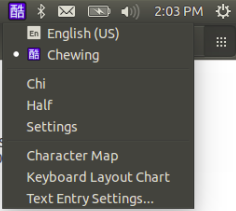
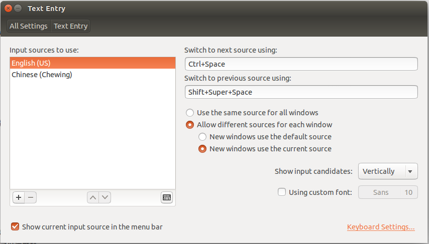

### 一、如何安裝輸入法引擎

1. 使用 auto.sh

    ```bash
    # 將先前安裝的同名引擎清除乾淨
    1 sudo make uninstall
    # 安裝輸入法引擎
    2 sudo make install
    # 重新啟動 IBus
    3 ibus restart
    ```

    其中，關鍵是第三點，重新啟動 IBus，筆者發現，若無重新啟動 IBus
    則在使用
    ```System Settings``` -> ```All Settings``` -> ```Text Entry``` -> ```Input Source to use``` 框框中左下方的 ```+```
    新增輸入法引擎時會找不到剛剛所安裝的輸入法引擎。

    詳如下圖：

    

    
